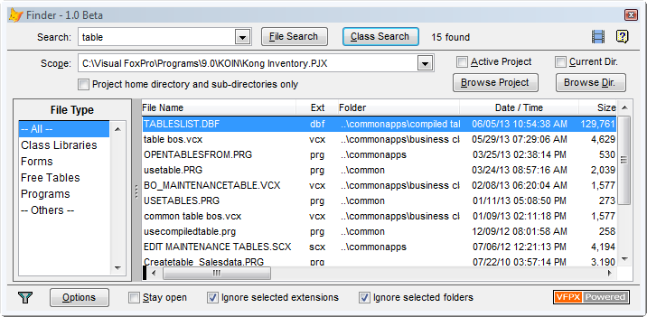
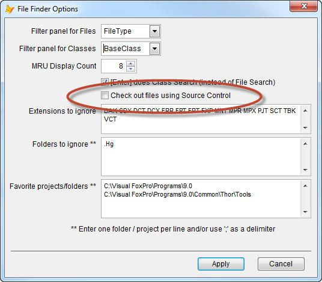

<h1>Finder</h1>

<strong>An advanced search tool for names of files and Visual FoxPro classes in projects or folders.</strong>

<strong>Getting Started: </strong>Like all VFPX projects, <em>Finder </em>
can be downloaded using Thor. If you have Thor installed, <em>Finder</em> shows up in &ldquo;Check For Updates&rdquo;. If not, see
<a href="https://github.com/VFPX/Thor">Thor installation instructions</a>.

Then watch the <a href="http://youtu.be/uL4a9gsCLlk">Finder introductory video</a>.

Note that <em>Finder</em> requires that Thor be active in order to work, as it is based on various Thor components.

<strong>It looks a lot like <em>GoFish!</em> </strong>This is by design.
<em>Finder</em> and <em>GoFish</em> are companion search engines. Both search VFP projects or folder/sub-folders, looking for different types of matches

<ul>
<li><em>Finder</em> searches for names of files or classes. </li><li><em>GoFish</em> searches for references in code. </li></ul>

<strong>Tooltips and context menus: </strong>Tooltips have been used fairly extensively, and the context menu on the rows in the grid provides a number of different options depending on the type of file selected.

<strong>Timestamps for SCXs, VCXs, and Classes: </strong>The timestamps displayed for SCXs and VCXs do not show the timestamp of the last time the file was changed (which may have occurred when building a project) but instead the most recent timestamp
 from the rows in the SCX/VCX. Similarly, the timestamps for classes are based on the most recent timestamp from the rows for the class.

<strong>Source Control: </strong>The options form, shown below, gives an option so that you will be asked whether you want to check out a file (if Source Control is used in the current project) before opening.

Other Source Control-related options may be added at a later date if there is interest.

(See further discussion of this at the very end, under the topic MRU Lists)

<h2><strong>Searching</strong></h2>

<strong>Basic Searching </strong>

The most basic and also most commonly used form of searching is to enter part of a file name or class name. The result is all files or classes where the entered text is part of the name. You can use wildcards (&lsquo;?&rsquo; and &lsquo;*&rsquo;) in your
 search. Searching is done by assuming a leading and trailing &lsquo;*&rsquo; and using the LIKE() function.

You can search for <u>all</u> file or class names by simply leaving the search field blank.

<strong>Advanced Searching</strong>

To find names beginning with text you enter, begin with &lsquo;^&rsquo;.

To find names ending with text you enter, end with &lsquo;$&rsquo;.

To find exact name matches with the text you enter, use &lsquo;!&rsquo; at the beginning or end.

<strong>Searching for File Name Extensions </strong>

To restrict your search to a particular file name extension, enter a dot and the extension after the search text. For example, &ldquo;JOB.PRG&rdquo; would find all PRG files that contain the text &ldquo;JOB&rdquo;

You can use wildcards when specifying an extension. &ldquo;JOB.?CX&rdquo; would search all forms and class libraries.

You can search multiple file extensions by entering each of them, separated by dots. Thus, you could also search all forms and class libraries by entering &ldquo;JOB.SCX.VCX&rdquo;

<strong>Searching Path Names </strong>

To search for names that are part of the full path for a file, follow the path name with &lsquo;\&rsquo;. For instance, searching for
<strong>Job\Show </strong>will find all files where <strong>Job </strong>is part of the the path name and
<strong>Show </strong>is part of the stem name. The actual search phrases used is
<strong>*JOB*\*SHOW*.*</strong>

To search for all names in a particular folder, enter the folder name followed by &lsquo;\&rsquo;.

<strong>Examples:</strong>

<blockquote>

SHOW&nbsp;&nbsp;&nbsp;&nbsp;&nbsp;&nbsp;&nbsp;&nbsp;&nbsp;&nbsp;&nbsp;&nbsp; == *SHOW*.*

SHOW.SCX&nbsp;&nbsp;&nbsp; == *SHOW*.SCX

'\' means you are searching the path as well, and is interpreted as *\*

JOB\&nbsp;&nbsp;&nbsp;&nbsp;&nbsp;&nbsp;&nbsp;&nbsp;&nbsp;&nbsp;&nbsp;&nbsp;&nbsp;&nbsp;&nbsp; == *JOB*\*.*&nbsp;&nbsp;&nbsp;&nbsp;&nbsp;&nbsp;&nbsp;&nbsp;&nbsp;&nbsp;&nbsp;&nbsp;&nbsp;&nbsp;&nbsp;&nbsp;&nbsp;&nbsp;&nbsp; Entire folder

JOB\SHOW&nbsp;&nbsp; == *JOB*\*SHOW*.*&nbsp;&nbsp;&nbsp; All files in JOB folder with SHOW in name

JOB\.SCX&nbsp;&nbsp;&nbsp;&nbsp;&nbsp;&nbsp; == *JOB*\*.SCX&nbsp;&nbsp;&nbsp;&nbsp;&nbsp;&nbsp;&nbsp;&nbsp;&nbsp;&nbsp;&nbsp;&nbsp;&nbsp; All SCX files in JOB folder

</blockquote>

<strong>Scope</strong>

The scope for your search may be either a project (which need not be open) or a folder (including sub-directories). The drop-down list shows a MRU list of projects and folders. In the options form you can also create a &ldquo;Favorites&rdquo; list of projects
 and/or folders to appear in this drop-down list.

<strong>Operations on Files or Classes</strong>

The original concept of this tool was to provide a simple mechanism for finding and opening files. Double-clicking any row in the grid will open the selected file or class. The underlying mechanism here is the FoxPro function EditSource(). There are a few
 other things that occur when the file is opened:

<ul>
<li>The file is opened using the same case as the file name on disk, so the case of the file name will not be changed.
</li><li>The file is added to the appropriate FoxPro MRU list. Other Thor tools allow you to access these lists without visiting the command window.
</li><li>If you use Source Control, you can use the Options form to indicate that you want to be asked to check out files from Source Control before opening them.
</li></ul>

You can also right-click on any row in the grid for a context menu. This items in this menu are sensitive to the extension of the file or class selected, and may include any of these options:

<ul>
<li>Open (same as Dbl-Click) </li><li>Run (for PRGs, SCXs, and FRXs) </li><li>Open with HackCX (this option is always available but only works if HackCX is installed)
</li><li>Create VCA/SCA/etc. file using SCCTextX </li><li>Pack </li><li>Modify Structure </li><li>Reindex </li><li>Look up Reference (if GoFish is installed &ndash; finds all references to the form/class)
</li><li>NewObject (inserts call to Object) </li><li>Create subclass </li><li>Create duplicate class </li><li>Descendant Classes </li><li>Sibling Classes </li><li>Where Used (where this class or its descendant classes are used) </li><li>Add to or Remove from current project </li><li>Open folder in Explorer </li><li>CD to this folder </li><li>Set scope to this folder </li></ul>

<strong>PRG-based classes</strong>

<em>Finder </em>locates classes that are defined in PRG and handles them just as it handles visual classes in VCXs

<strong>Sorting or filtering the Grid</strong>

You can sort the grid by clicking on a column header.

You can filter the rows in the grid by right-clicking in a column header (other than the timestamp or size columns).

<strong>Drag/Drop classes</strong>

When you have searched for classes, you can drag the class from the current highlighted row in the grid and drop it on a form or class you are editing. You can begin dragging it by either:<u></u><u></u>

<ul>
<li>Dragging the icon that appears just above the upper left hand corner of the grid.<u></u><u></u>
</li><li>Or holding down the Shift or Ctrl key and dragging the <u>row from the grid</u>.
</li></ul>

You can then drop the class onto a form or class you are editing, just like you do from the Class Browser. If the object under the mouse is a container, the class is added as a child object in the container, else it is added as a sibling.

As an alternative, you can also drop the class on PEM Editor. In this case, the object is added as a child or sibling of the object that is current displayed in PEM Editor. This makes it very easy to drop classes into hard to get at places, such as columns
 in a grid or containers that are obscured in the form/class being edited. Simply navigate to the container object (using PEM Editor, Property Window, etc.) and then drop the class onto PEM Editor.

<strong>Persistence of Settings</strong>

Most of the settings of the form persist from session to session, including its size and position, search text, scope, column widths and order, the results grid, and the current row in that grid

<strong>Dockable vs not-dockable </strong>

By default, the form is dockable. This choice was not made because of the expectation that the form will ever be docked, but rather because of three effects of making it dockable.

<ol>
<li>

When opened, it goes on top of all other forms, including other dockable forms.

</li><li>

It can be moved outside the visible FoxPro screen

</li><li>

The setting for Dockable can be turned off by right-clicking the titlebar of the form

</li></ol>

You can turn off the Dockable setting, allowing the form to go behind other non-dockable windows, if desired, as long as you are careful to do so when the form is within the FoxPro screen and is not on top of a dockable window.

<strong>MRU Lists and Source Control</strong>

As noted earlier, any file opened is automatically added to the appropriate FoxPro MRU list, as if it had been opened from the command window. These MRU lists can be accessed by right-clicking on either the &ldquo;File Search&rdquo; button (for files)
 or the &ldquo;Class Search&rdquo; button (for classes and class libraries).

MRU lists are not kept current when files are opened from either the Project Manager or the Class Browser (an unfortunate oversight). However, this can be corrected by using files found in folder Thor\Tools\Samples:

<ul>
<li>Class Library &lsquo;BaseProjectHooks.VCX&rsquo; contains a class that can be used as a ProjectHook for a project. If you are already using a ProjectHook class, you can simply use the QueryModifyFile method from this class.
</li><li>File &lsquo;Browser.APP&rsquo; can be used to replace the file of the same name in Home(1).
</li></ul>

If you are using Source Control in the current project, each of these replacement programs will also ask whether you want to check out the file before opening it.

